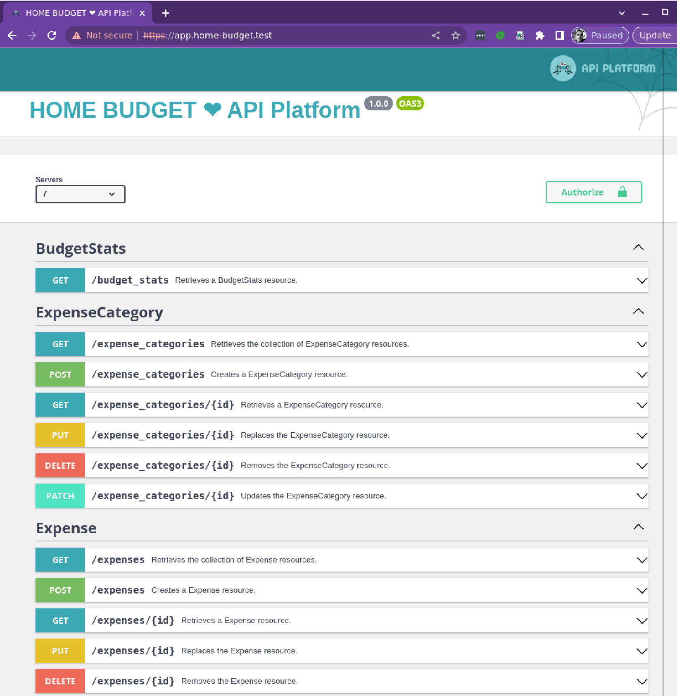
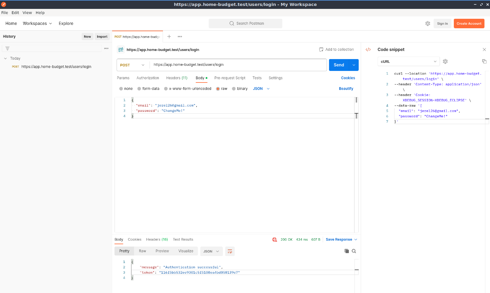
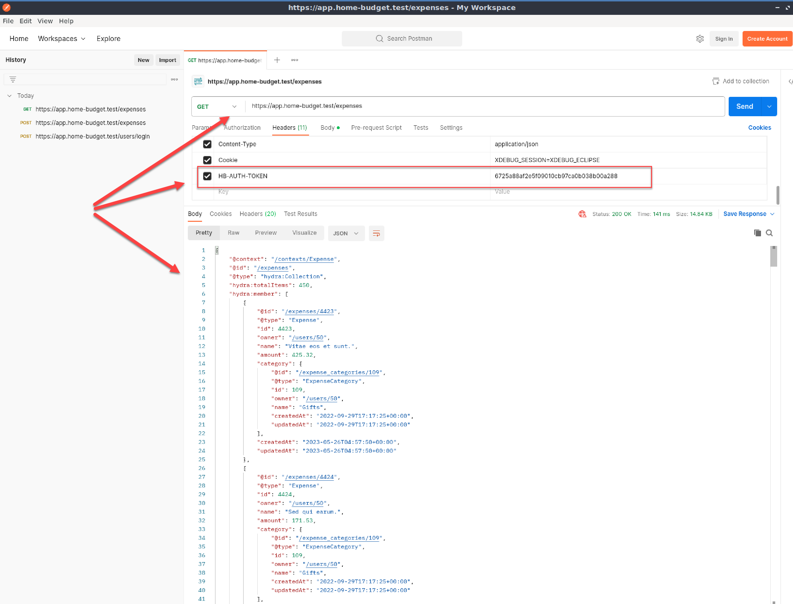

# HOME BUDGET ❤ API Platform

The **HOME BUDGET ❤ API Platform** application is a REST API backend powered by [Symfony API Platform](https://api-platform.com/).

Key features of an application:
- user register, via API `POST /users`
- user login, via API `POST /users/login`
- income categories management, via API `GET|POST|PUT|DELETE|PATCH /income_categories`
- income management, via API `GET|POST|PUT|DELETE|PATCH /incomes`
- expense categories management, via API `GET|POST|PUT|DELETE|PATCH /expense_categories`
- expense management, via API `GET|POST|PUT|DELETE|PATCH /expenses`
- budget statistics (daily, weekly, monthly, quarterly, yearly), via API `GET /budget_stats`
- each endpoint should return only the currently logged-in user data

## Installation

This application is basically Symfony stack, so in a same way you would prepare Symfony environment services (web server, database server, etc...), you prepare your environment here.   

If this is not a familiar ground, following would be some good suggested reading - [Installing & Setting up the Symfony Framework](https://symfony.com/doc/current/setup.html).

Once your local environment is sorted to run Symfony project; we need to take the following **mandatory** steps:

* `git clone git@github.com:ajzele/home-budget-api.git`
* copy `.env` into `.env.local` and configure relevant keys (such as `TRUSTED_HOSTS`, `DATABASE_URL`)
* `composer install`
* `bin/console doctrine:migrations:migrate`
* `bin/console doctrine:fixtures:load`
* You should now be able to see the following tables in your database, as well with some data in them:
    ```text
    doctrine_migration_versions
    expense
    expense_category
    income
    income_category
    user
    ```
* You should also be able to open your browser and point to **base URL of your locally set project**, and see the local [Swagger](https://swagger.io/tools/swagger-ui/) interface showing **HOME BUDGET ❤ API Platform** title and a list of various API endpoints as shown below.




From here on you should be able to:
- Use the local [Swagger](https://swagger.io/tools/swagger-ui/) interface, as documentation, to inspect available endpoints and their data structure
- Use the [Postman](https://www.postman.com/downloads/) to issue requests towards API (**base URL of your locally set project**) 

## Using POSTMAN

### For logging in

When we ran the `bin/console doctrine:fixtures:load` earlier, this created couple of tests users for us earlier.

If we open the `user` table, we can pick any user `email` from there, with a default assigned `ChangeMe!` password, and issue following request via Postman.

REQUEST:

```

curl --location 'https://app.home-budget.test/users/login' \
--header 'Content-Type: application/json' \
--data-raw '{
  "email": "jerel26@gmail.com",
  "password": "ChangeMe!"
}'

```

RESPONSE:

```
{
    "message": "Authentication successful",
    "token": "76d63d8453836b3da54cc0294751239cf701"
}
```

as shown below.



We should now be able to grab this token, and use with all the rest of **authenticated requests** API requests.

Upon each login, database `user.token` is refreshed.

### For executing authenticated requests

All requests towards endpoints must be authenticated.

Simply set the header named `HB-AUTH-TOKEN` to value of user `token` we obtained during login, as shown below.



### For debugging in PhpStorm

Simply set the header named `Cookie` to value `XDEBUG_SESSION=XDEBUG_ECLIPSE`.

E.g.:

```

curl --location 'https://app.home-budget.test/users/login' \
--header 'Content-Type: application/json' \
--header 'Cookie: XDEBUG_SESSION=XDEBUG_ECLIPSE' \
--data-raw '{
  "email": "jerel26@gmail.com",
  "password": "ChangeMe!"
}'

```

With the header set, PhpStorm should be able to catch it.

## Useful commands:

To re-run DB-Entity sync on DB-Entity changes, run:

`bin/console make:migration`
`bin/console doctrine:migrations:migrate`

### Factory creation

`bin/console make:factory`

### Fixture creation

Generation itself is done via `php bin/console make:fixtures SomeEntityFixtures`. Fixtures end up in `src/DataFixtures` directory.

To load the fixtures into database `php bin/console doctrine:fixtures:load`.